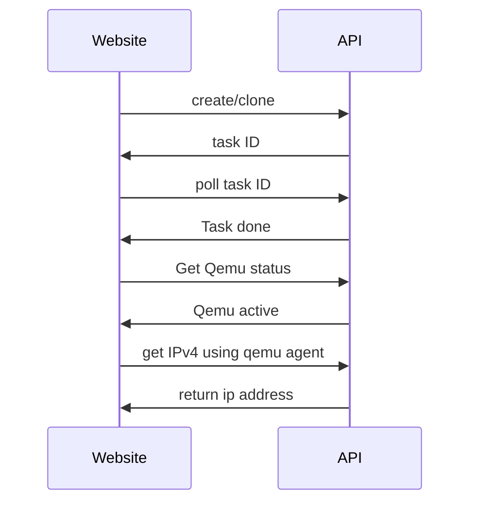

# Overview 

```mermaid
sequenceDiagram
    participant Website
    participant API
    
    Website->>API: create/clone
    API->>Website: task ID
    
    Website->>API: poll task ID
    API->>Website: Task done
    
    Website->>API: Get Qemu status
    API->>Website: Qemu active
    
    Website->>API: get IPv4 using qemu agent
    API->>Website: return ip address
``` 

